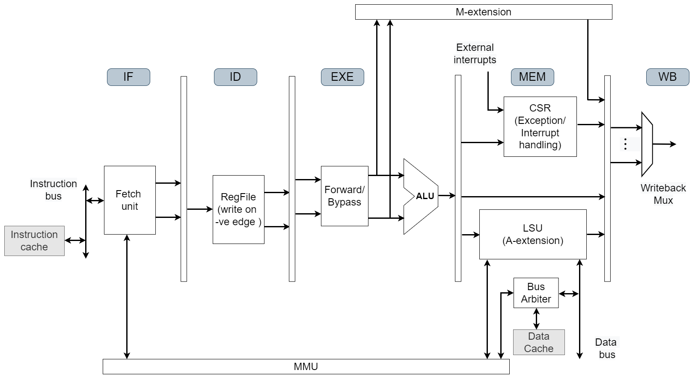
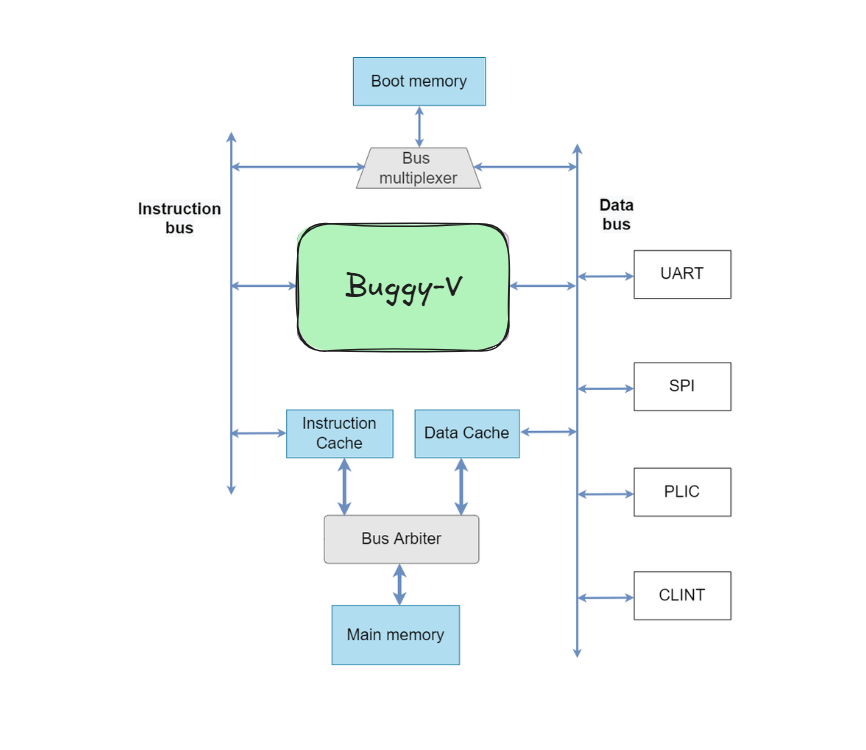

# Buggy-V-Pcore

Buggy-V_Pcore is a RISC-V based application class SoC integrating a 5-stage pipelined processor with memory and peripherals. Currently, the core implements RV32IMACZicsr ISA based on User-level ISA Version 2.0 and Privileged Architecture Version 1.11 supporting M/S/U modes. Following are the key features of the SoC:

## Key Features
- 32-bit RISC-V ISA core that supports base integer (I) and multiplication and division (M), atomic (A), compressed (C) and Zicsr (Z) extensions (RV32IMACZicsr).
- Supports user, supervisor and machine mode privilege levels.
- Support for instruction / data (writeback) caches.
- Sv32 based MMU support and is capable of running Linux.
- 32 KB 4-way set associative instruction cache.
- 32-KB direct mapped write-back data cache. 
- Cache size, TLB entries etc., are configurable.
- Intergated PLIC, CLINT, uart, spi peripherals. 
- Uses RISOF framework to run architecture compatibility tests.
- Coremark: **2.0 Coremark/MHz** with DDR2 based main memory.
- LUTs for core (including MMU) < 4.5k and for the SoC (including cache controllers but excluding DDR controller) < 6k.

### System Design Overview
The Buggy-V_Pcore is an applicaion class processor capable of running Linux. A simplified 5-stage pipelined block diagram is shown below. The M-extension is implemented as a coprocessor while memory-management-unit (MMU) module is shared by instruction and data memory (alternatively called load-store-unit (LSU)) interfaces of the pipeline. Specifically, the page-table-walker (PTW) of the MMU is shared and there are separate TLBs (translation look aside buffers) for instruction and data memory interfaces. The A-extension is implemented as part of the LSU module.



The SoC block diagram shows the connectivity of the core with memory sub-system as well as different peripherals using data bus. The boot memory is connected to both instruction and data buses of the core using a bus multiplexer. The instruction and data caches share the main memory using a bus arbiter. Different necessary peripherals are connected using the data bus. Further details related to the SoC design are available at <https://Buggy-V-pcore-doc.readthedocs.io/en/main/>.



### SoC Memory Map
The memory map for the SOC is provided in the following table.
| Base Address        |    Description            |   Attributes    |
|:-------------------:|:-------------------------:|:---------------:|
| 0x8000_0000         |      Memory               |      R-X-W      |
| 0x9000_0000         |      UART                 |      R-W        |
| 0x9400_0000         |      PLIC                 |      R-W        |
| 0x9C00_0000         |      SPI                  |      R-W        |
| 0x0200_0000         |      CLINT                |      R-W        |
| 0x0000_1000         |      Boot Memory          |      R-X        |

- `R: Read access`
- `W: Write access`
- `X: Execute access`


## Getting Started

Install RISC-V [toolchain](https://github.com/riscv-collab/riscv-gnu-toolchain) and [verilator](https://verilator.org/guide/latest/install.html). These tools can be built by following the instructions in the corresponding links, or can be installed directly by running the following command

    sudo apt-get install -y gcc-riscv64-unknown-elf verilator gtkwave

Check that these tools are installed correctly, by running `verilator --version` and `riscv64-unknown-elf-gcc -v`.

### Build Model and Run Simulation

Verilator model of Pcore can be built using Makefile:

    make verilate

The verilator model is build under `ver_work/Vpcore_sim`. The executeable can accept the following three parameters:

- `imem`: This paramerter accepts the file that contain the hexadecimal instructions of compiled program.
- `max_cycles`: This parameter cotrols the maxiumum number of cycles for simulation. Simulation terminates after executing these many cycles.
- `vcd`: This parameters accepts a boolean value. If it is 0, the waveform file `trace.vcd` will not be dumped and vice versa.

An example program to print `HELLO` on terminal via UART is compiled and its hex instructions are availabe in [here](/sdk/example-uart/hello.hex). Run the following command to simulate the example program

    make sim-verilate-uart 

This will simulate `hello.hex` and dump UART logs in `uart_logdata.log` file. If `vcd=1` is added to the above command, `trace.vcd` will be created that can be viewed by running

    gtkwave trace.vcd

The `imem` and `max_cycles` may be overwritten in Makefile using.

    make sim-verilate-uart imem=</path/to/hex/file> max_cycles=<No. of cycles> 


## Project Structure

```
buggy-v/
├── bench/                         # Testbench files for simulation and verification
│   ├── pcore_tb.cpp
│   └── pcore_tb.sv
├── docs/                          # Documentation and guides
│   ├── images/
│   └── pss-env-setup-guide.md
├── Makefile                       # Build automation for Verilator compilation and simulation
├── README.md                      # Project overview and getting started guide
├── rtl/                           # Register Transfer Level (HDL) implementation of the SoC
│   ├── core/                      # RISC-V processor core with 5-stage pipeline
│   │   ├── core_top.sv
│   │   ├── mmu/                   # Memory Management Unit with TLBs and page table walker
│   │   └── pipeline/              # 5-stage pipeline stages (fetch, decode, execute, memory, writeback)
│   ├── defines/                   # Configuration macros for extensions and subsystems
│   │   ├── a_ext_defs.svh
│   │   ├── cache_defs.svh
│   │   ├── ddr_defs.svh
│   │   ├── m_ext_defs.svh
│   │   ├── mmu_defs.svh
│   │   ├── pcore_config_defs.svh
│   │   ├── pcore_csr_defs.svh
│   │   ├── pcore_interface_defs.svh
│   │   ├── plic_defs.svh
│   │   ├── spi_defs.svh
│   │   └── uart_defs.svh
│   ├── interconnect/              # Data bus and arbiter for SoC connectivity
│   │   └── dbus_interconnect.sv
│   ├── memory/                    # Memory subsystem including caches and boot memory
│   │   ├── bmem_interface.sv
│   │   ├── bmem.sv
│   │   ├── icache/                # Instruction cache (32KB, 4-way set-associative)
│   │   ├── main_mem.sv
│   │   ├── mem_top.sv
│   │   ├── Testbenches/           # Unit tests for cache and memory modules
│   │   └── wb_dcache/             # Write-back data cache (32KB, direct-mapped)
│   ├── peripherals/               # I/O peripherals for system integration
│   │   ├── clint/                 # Core Local Interrupt Timer for timer and IPI
│   │   ├── plic/                  # Platform-Level Interrupt Controller for external interrupts
│   │   ├── spi/                   # Serial Peripheral Interface for external devices
│   │   └── uart/                  # Universal Asynchronous Receiver Transmitter for serial I/O
│   └── soc_top.sv
├── sdk/                           # Software Development Kit with example programs
│   └── example-uart/              # Example UART application demonstrating hello message printing
│       └── Makefile
├── setup.sh                       # Automated environment setup script (installs toolchain, Verilator, dependencies)
└── LICENSE
```

