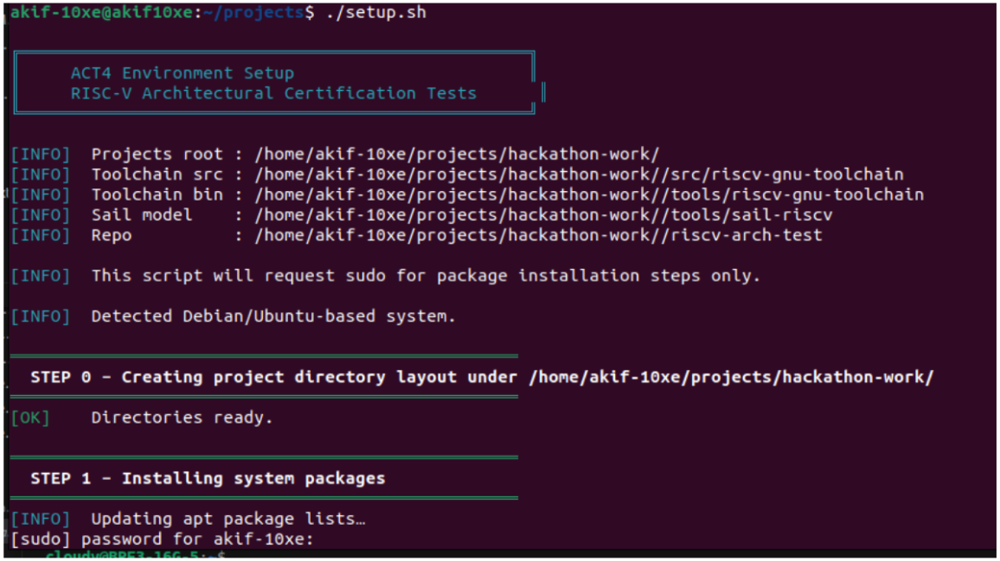
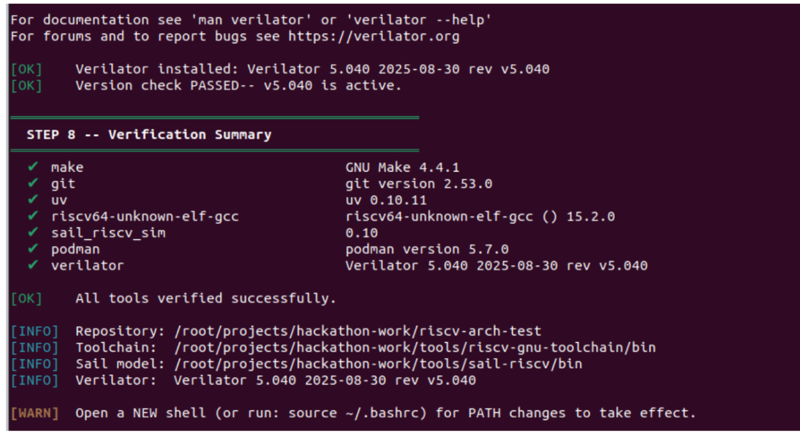

# PSS Environment Setup Guide

These are the tools/utilities required for the hackathon:

1. System packages (make, git, GCC build-deps, podman)
2. uv (Python project / venv manager)
3. RISC-V GNU Toolchain (riscv64-unknown-elf-gcc, built from source)
4. RISC-V Sail Reference Model v0.10 (pre-built binary)
5. riscv-arch-test repo (act4 branch)
6. Verilator simulator

## Install via script (recommended)

This setup is compatible with Debian/Ubuntu Linux systems.

Run these commands in your terminal. These commands will download and run the setup script, which contains instructions to setup the environment.

```bash
curl -L "https://gist.githubusercontent.com/akifejaz/c59ab187627eec8a48327cbe0bcb198e/raw/b4070b967aac195a96eba941e1c7be4367a4317e/setup_act4_env.sh" -o setup.sh
chmod +x setup.sh
./setup.sh
```

OR 

```bash
cd <path-to-Buggy-V-directory>/
chmod +x setup.sh
./setup.sh
```

> NOTE: This will ask you for a password (sudo). It will also ask "Continue with toolchain build? [y/N]" — enter "y" to build.

## Expected workspace output

Default root directory after setup is typically:

- `/home/akif-10xe/projects/hackathon-work/`
- `src/riscv-gnu-toolchain`
- `tools/riscv-gnu-toolchain`
- `tools/sail-riscv`
- `riscv-arch-test`

Example runtime output:

```text
╔══════════════════════════════════════════════════╗
║     ACT4 Environment Setup                       ║
║     RISC-V Architectural Certification Tests     ║
╚══════════════════════════════════════════════════╝

[INFO]  Projects root : /home/akif-10xe/projects/hackathon-work/
[INFO]  Toolchain src : /home/akif-10xe/projects/hackathon-work//src/riscv-gnu-toolchain
[INFO]  Toolchain bin : /home/akif-10xe/projects/hackathon-work//tools/riscv-gnu-toolchain
[INFO]  Sail model    : /home/akif-10xe/projects/hackathon-work//tools/sail-riscv
[INFO]  Repo          : /home/akif-10xe/projects/hackathon-work//riscv-arch-test

```
So, your default root work directory is `/home/akif-10xe/projects/hackathon-work/`

## Verify install

Run these commands after completion to confirm:

```bash
riscv64-unknown-elf-gcc --version
sail_riscv_sim --version
uv --version
podman --version
```

## Example Run



It will take around 30 to 40 minutes depending on hardware. Successful run looks like this:




> NOTE: Restart your system after install if required.
